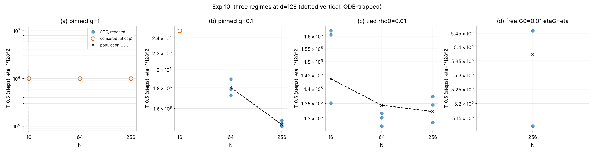

# Experiment 10: the three regimes at d=128 (single neuron, Model A pinned / tied A-tilde / free readout, k=2)

- **Pre-registration:** `docs/preregistration.md`, section "Three regimes at a second `d` (exp 10, backlog N2)" (P23a-d; committed in 692081e before any run)
- **Code:** `icl_additive/{sweep10,analyze10,train}.py`; ODE predictions `scripts/ode_exp10.py` -> `ode_predictions.txt`
- **CPU time:** 3.757 CPU-h (cap 5; cap not reached, no run dropped); wall 5010 s on 4 workers
- **Deviations from pre-registration:** none in the protocol; the pre-registered d=64 free baseline "tau = 50.1" is the wrong cell (see Deviations), which decides P23d

Spec: `docs/spec_exp10.md`. Raw rows: `runs.csv` (26 runs), trajectories `traj/*.npz` (gitignored), `stdout.txt`. Derived: `summary.csv`, `verdicts.csv`,
`secants.csv`, `tables.md`, `figs/regimes_d128.png`.

## Setup (as pre-registered)

sigma_2, d=128, `init="fixed"`, `m0_scale=1.0` so m_0 = d^-1/2 = 0.0884 exactly, eta = 1/d^2 = 6.104e-5, B=64, early stop |m| >= 0.5, `log_every=100`, `fast=True`,
`rng_tag=1000`, 1 BLAS thread per worker, 4 workers. Cells: (a) pinned Gamma=1, N in {16,64,256}, seeds 0-1, cap 1e6; (b) pinned Gamma=0.1, N in {16,64,256}, seeds 0-2, cap 2.5e6;
(c) tied rho_0=0.01, N in {16,64,256}, seeds 0-2, cap 1e6; (d) free Gamma_0=0.01 (`train_gamma=True`, eta_Gamma=eta), N=256, seeds 0-1, cap 1.2e7.
Flow time = steps * eta. "Median" counts a censored run (no |m|=0.5 within the cap) as +infinity. Launch order: c, b (N=64,256), a, b (N=16), d.

## Deviations (read first)

- **P23d baseline error in the pre-registration.** The pre-registered secant uses "exp 6's d=64 value (tau = 50.1)". 50.1 is the ODE flow of exp 7 cell (a)
  (free, eta_Gamma = **10** eta, N=256; see prereg row P20a), not of exp 6's free protocol (eta_Gamma = eta), whose ODE flow at d=64, N=256 is 101.0
  (413696 steps / 4096; SGD median 411137 steps = 100.4). Against the correct like-for-like baseline the ODE secant is 5.40, not 7.4. The pre-registered number 7.4
  therefore compares unlike protocols. I applied the pre-registered criterion as written (SGD secant against 7.4) and report the like-for-like numbers next to it. I did not edit the pre-registration.
- **Run count 26, not 23.** The spec's cell list (9 + 9 + 6 + 2 seeds-by-N) sums to 26; I ran every cell as specified. The "23" in the spec/brief is an arithmetic slip.
- All 4 cores were available from the start (exp 8 finished), so all runs used 4 workers; no 2-worker phase.
- CPU time 3.757 h vs 5 h cap (no run dropped, both free seeds completed). Per cell (CPU-h): (a) 0.53, (b) 1.33, (c) 0.11, (d) 1.78. Per-run CPU: tied 17-110 s; pinned a 114-630 s; b 283-922 s; free 3095 s and 3327 s.
  Not counted: a ~1 s smoke test (cell c, N=16, max_steps 2000, scratchpad). CPU time is per-process `process_time`; with 4 busy workers wall times are not clean.
- Trajectories `traj/*.npz` are gitignored (repo rule `results/**/traj/*.npz`) and not in the commit.
- `runs.csv` column `readout_at_T05` is rho (tied) or Gamma (free), read from the log every 100 steps; NaN for pinned cells.

## Table: T_0.5 per seed vs ODE

CENS = no escape to |m|=0.5 within the cap; ODE "trapped" = m_0 <= m* (pinned, closed form) or drift turns negative (tied LSODA).

| cell | N | T_0.5 per seed (steps) | reached | median steps | median flow T*eta | ODE flow | ODE steps | median/ODE | readout at T_0.5 (seeds) | final \|m\| |
|---|---|---|---|---|---|---|---|---|---|---|
| a pinned g=1 | 16 | CENS/CENS | 0/2 | inf | inf | trapped | trapped | - | - | 0.014/0.005 |
| a pinned g=1 | 64 | CENS/CENS | 0/2 | inf | inf | trapped | trapped | - | - | 0.002/0.002 |
| a pinned g=1 | 256 | CENS/CENS | 0/2 | inf | inf | trapped | trapped | - | - | 0.004/0.006 |
| b pinned g=0.1 | 16 | CENS/CENS/CENS | 0/3 | inf | inf | trapped | trapped | - | - | 0.029/0.033/0.022 |
| b pinned g=0.1 | 64 | 1783191/1896305/1722126 | 3/3 | 1783191 | 108.8 | 110.1 | 1.8e+06 | 0.989 | - | 0.500/0.500/0.500 |
| b pinned g=0.1 | 256 | 1466097/1493848/1445353 | 3/3 | 1466097 | 89.5 | 89.0 | 1.46e+06 | 1.006 | - | 0.500/0.500/0.500 |
| c tied rho0=0.01 | 16 | 162187/135030/160529 | 3/3 | 160529 | 9.8 | 8.8 | 1.44e+05 | 1.118 | 0.01063/0.01077/0.01099 | 0.500/0.500/0.500 |
| c tied rho0=0.01 | 64 | 131662/127407/130146 | 3/3 | 130146 | 7.9 | 8.2 | 1.34e+05 | 0.969 | 0.01139/0.01138/0.01142 | 0.500/0.501/0.500 |
| c tied rho0=0.01 | 256 | 137243/134382/128556 | 3/3 | 134382 | 8.2 | 8.1 | 1.32e+05 | 1.017 | 0.01145/0.01145/0.0115 | 0.500/0.500/0.500 |
| d free G0=0.01 etaG=eta | 256 | 5458606/5121944 | 2/2 | 5290275 | 322.9 | 327.9 | 5.37e+06 | 0.985 | 0.2371/0.2375 | 0.500/0.500 |

ODE rho at T_0.5 for cell (c): 0.01092 / 0.01135 / 0.01146 (N=16/64/256); measured 0.0106-0.0110 / 0.0114 / 0.0115-0.0115.

## Censoring table

| cell | N=16 | N=64 | N=256 | cap |
|---|---|---|---|---|
| a pinned g=1 | 2/2 | 2/2 | 2/2 | 1000000 |
| b pinned g=0.1 | 3/3 | 0/3 | 0/3 | 2500000 |
| c tied rho0=0.01 | 0/3 | 0/3 | 0/3 | 1000000 |
| d free G0=0.01 etaG=eta | - | - | 0/2 | 12000000 |

Tied N-ratio T(16)/T(256) = 1.195 (ODE 1.086, pre-reg 1.09); T(16)/T(64) = 1.233, T(64)/T(256) = 0.968

Free secant kappa = 2 - ln(tau128/tau64)/ln(2^-1/2):

| numerator (d=128) | denominator (d=64) | kappa |
|---|---|---|
| ODE 327.9 | ODE 50.1 (pre-registered baseline) | 7.42 |
| ODE 327.9 | ODE 101.0 (exp 6 free eta_Gamma=eta, N=256, B=64) | 5.40 |
| SGD median 322.9 flow | SGD exp 6 median 100.4 flow | 5.37 |
| SGD median 322.9 | 50.1 (pre-registered baseline; wrong cell, shown only to reproduce the pre-registered arithmetic) | 7.38 |

All censored runs ended with |m| <= 0.033 (a: <= 0.014), i.e. at the origin-side trap, not creeping towards 0.5.

## Verdicts

**P23a (pinned Gamma=1). HELD.** Criterion (quoted): "censored 2/2 at every N". Measured: N=16, 64, 256 each censored 2/2 at 1e6 steps (final |m| 0.002-0.014). Default ("N=256 escapes") not triggered.

**P23b (pinned Gamma=0.1). HELD.** Criterion (quoted): "N=16 censored >= 2/3 at 2.5e6; N=64, 256 medians within 15%". Measured: N=16 censored 3/3 (final |m| 0.022-0.033), the d=64 -> d=128 flip to trapped as predicted;
N=64 median 1783191 vs ODE 1.80e6 (0.989), N=256 median 1466097 vs ODE 1.46e6 (1.006), both seed spreads under 10%. The ratio T(64)/T(256) = 1.22 (ODE 1.24): N-saturating, not 1/N.
Default ("N=16 escapes 3/3") not triggered. **Kill for the "trap for d > d*(N)" statement (P23b N=16 escapes 3/3 and P23a N=256 escapes 2/2) not triggered**: neither escaped.

**P23c (tied). HELD.** Criterion (quoted): "medians within 15%; ratio within +-0.15 of 1.09". Measured median/ODE = 1.118 (N=16), 0.969 (N=64), 1.017 (N=256); all within 15% (N=16 is the closest, +11.8%).
T(16)/T(256) = 160529/134382 = 1.195 (|1.195 - 1.09| = 0.105 <= 0.15; ODE 1.086). Default ("ratio > 2") not triggered. The ratio is a little above the ODE value and the N=16 seeds are the slowest and most spread (135-162k), but within the declared band.
rho at T_0.5 stays at 0.0106-0.0115 as predicted (ODE 0.0109-0.0115).

**P23d (free, N=256). FAILED as pre-registered, on the secant leg only.** Criterion (quoted): "median within 15%; secant within +-0.5 of 7.4". Median leg: SGD seeds 5458606 / 5121944, median 5290275 vs ODE 5.37e6 (0.985), ok.
Secant leg: with exp 6's measured d=64 free N=256 median (411137 steps = 100.4 flow) the SGD secant is **5.37**, which is 2.0 below 7.4, OUT. Default ("secant <= 4.5 or >= 8.5") not triggered.
The cause is the pre-registration, not the SGD/ODE gap: the quoted baseline 50.1 belongs to exp 7's eta_Gamma = 10 eta cell, and the like-for-like ODE secant (327.9 / 101.0) is 5.40, matched by SGD (5.37).
So the flow prediction for d=128 is confirmed to 1.5%, the "crossover regime between 4 and 8" qualitative statement holds (5.4), but the specific number 7.4 was wrong and the pre-registered criterion is failed as written.

## Summary

Held: P23a, P23b, P23c (and the median leg of P23d, 0.985). Failed as pre-registered: P23d secant leg (5.37 vs 7.4), because the pre-registered baseline mixed protocols; like-for-like ODE and SGD secants agree (5.40 vs 5.37).
Across the 10 cell-by-N combinations the ODE trap classification (trapped: a all N, b N=16; escaping: b N=64,256, c, d) is reproduced with no exception. 26 runs, 3.757 CPU-h (cap 5 h).

Note (added after review 4): the like-for-like d=64 baseline 101.0 above is the Euler value; LSODA (`tau_free(1/8, 0.01, 256, r=1)` in `scripts/verify_theorems.py`) gives 99.9, secant 5.43. Same conclusion.
