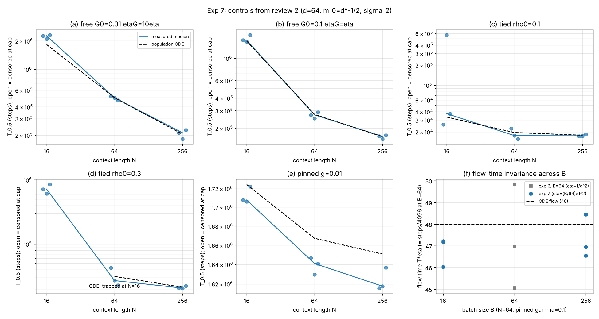

# Experiment 7: controls requested by review 2 (Model A / tied, k=2, d=64)

- **Pre-registration:** `docs/preregistration.md`, section "Controls requested by review 2 (exp 7)" (P20a-f)
- **Code:** `icl_additive/{sweep7,analyze7,train}.py`
- **CPU time:** 2.20 CPU-h (cap 2; overrun 10%)
- **Deviations from pre-registration:** cell (d) cap reduced to 1e6 steps (censored nothing); CPU overran the cap by 10% because the cap only gates launching runs

Pre-registration: `docs/preregistration.md`, section "Controls requested by review 2 (exp 7)" (P20a-f; flow times fixed before the run).
Code: `icl_additive/sweep7.py` (reuses `train.train`, same single-neuron code and conventions as `sweep6.py`), analysis
`icl_additive/analyze7.py`. Raw rows: `runs.csv` (51 runs), per-run trajectories `traj/`, stdout `stdout.txt`. Derived: `summary.csv`
(per cell/N/B), `ratios.csv`, `f_invariance.csv`, `figs/controls.png`.

Setup as pre-registered: sigma_2, d=64, m_0 = d^-1/2 = 0.125 exactly, eta = 1/d^2 = 1/4096, B = 64, N in {16,64,256}, 3 seeds (same seeds
and `rng_tag` as exp 6), early stop at |m| >= 0.5, cap 2.5e6 steps. Cells: (a) free Gamma_0=0.01, eta_Gamma=10 eta; (b) free Gamma_0=0.1,
eta_Gamma=eta; (c) tied rho_0=0.1; (d) tied rho_0=0.3; (e) pinned gamma=0.01; (f) pinned gamma=0.1, N=64, B in {16,256}, eta=(B/64)/d^2.
Flow time = T*eta (steps/4096 at eta=1/d^2). "Median" counts censored runs as +infinity; no run was censored (51/51 reached |m|=0.5).

## Deviations (read first)

- **(d) cap reduced to 1e6 steps** (budget; allowed by the brief). Pilot (3 seeds, 3e5 steps, N=16): m fell to ~0 and rho decayed 0.3 -> 0.024
  (trap-like at that point). In the main run all three (d) N=16 seeds escaped at 6.1e5-8.5e5 steps, i.e. *inside* the reduced cap, so the
  reduction censored nothing. (d) N=64, 256 also ran with cap 1e6 (they finish at 2-4e4).
- **CPU time 2.20 h vs the 2 h hard cap (overrun 10%).** The sweep's cap only gates *launching* runs; the last four (e) N=256 runs
  (pinned gamma=0.01, ~1.0e3 s each, 1.6e6 steps at ~640 us/step with 4 busy workers) were launched at ~1.3 h and ran past the cap. My pre-run
  estimate (2.0 h) was ~10% low. Per cell (CPU-h): (a) 0.40, (b) 0.28, (c) 0.04, (d) 0.09, (e) 1.30, (f) 0.10. Not counted: a ~1-minute first launch killed by my own `pkill` (2 runs, results
  discarded, `runs.csv` deleted and restarted from scratch) and the 3-run (d) pilot (~0.03 h).
- (f) reference at B=64 is exp 6 (`results/exp6/runs.csv`, pinned gamma=0.1, N=64, B=64, eta=1/d^2, same seeds and code) rather than a re-run.
  The ODE has no B-dependence; its flow time for that cell is 48 (exp 6).
- Readout at T_0.5 is read from the log (every 100 steps).

## Table: T_0.5 per seed vs ODE (cells a-e)

| cell | N | B | T_0.5 per seed (steps) | reached | final \|m\| | median steps | median flow T*eta | ODE flow | ODE steps | median/ODE | readout at T_0.5 (seeds) |
|---|---|---|---|---|---|---|---|---|---|---|---|
| a free G0=0.01 etaG=10eta | 16 | 64 | 2263467 / 2100238 / 2311855 | Y/Y/Y | 0.500/0.500/0.500 | 2263467 | 552.6 | 447 | 1830912 | 1.24 | 0.2166/0.1933/0.1922 |
| a free G0=0.01 etaG=10eta | 64 | 64 | 517368 / 498454 / 468181 | Y/Y/Y | 0.500/0.500/0.500 | 498454 | 121.7 | 122 | 499712 | 1.00 | 0.453/0.4423/0.4361 |
| a free G0=0.01 etaG=10eta | 256 | 64 | 212403 / 182887 / 226457 | Y/Y/Y | 0.500/0.500/0.500 | 212403 | 51.9 | 50.1 | 205210 | 1.04 | 0.5961/0.5841/0.565 |
| b free G0=0.1 etaG=eta | 16 | 64 | 1518320 / 1462093 / 1708218 | Y/Y/Y | 0.500/0.500/0.500 | 1518320 | 370.7 | 363 | 1486848 | 1.02 | 0.1401/0.1494/0.1457 |
| b free G0=0.1 etaG=eta | 64 | 64 | 271297 / 251163 / 288977 | Y/Y/Y | 0.500/0.500/0.500 | 271297 | 66.2 | 66.9 | 274022 | 0.99 | 0.2092/0.206/0.2118 |
| b free G0=0.1 etaG=eta | 256 | 64 | 165761 / 156440 / 170009 | Y/Y/Y | 0.500/0.500/0.500 | 165761 | 40.5 | 40.1 | 164250 | 1.01 | 0.2472/0.2483/0.246 |
| c tied rho0=0.1 | 16 | 64 | 25615 / 567222 / 37423 | Y/Y/Y | 0.500/0.500/0.500 | 37423 | 9.1 | 8.13 | 33300 | 1.12 | 0.08248/0.01372/0.07416 |
| c tied rho0=0.1 | 64 | 64 | 22490 / 17515 / 15694 | Y/Y/Y | 0.500/0.500/0.500 | 17515 | 4.3 | 4.76 | 19497 | 0.90 | 0.1043/0.1066/0.1085 |
| c tied rho0=0.1 | 256 | 64 | 17275 / 17435 / 18409 | Y/Y/Y | 0.500/0.500/0.500 | 17435 | 4.3 | 4.34 | 17777 | 0.98 | 0.1111/0.1123/0.1113 |
| d tied rho0=0.3 | 16 | 64 | 716171 / 610151 / 846455 | Y/Y/Y | 0.500/0.500/0.500 | 716171 | 174.8 | trapped (inf) | - | - | 0.01251/0.01395/0.01065 |
| d tied rho0=0.3 | 64 | 64 | 42956 / 27028 / 22929 | Y/Y/Y | 0.500/0.500/0.500 | 27028 | 6.6 | 7.67 | 31416 | 0.86 | 0.2298/0.2554/0.2693 |
| d tied rho0=0.3 | 256 | 64 | 20641 / 20451 / 22326 | Y/Y/Y | 0.500/0.500/0.500 | 20641 | 5.0 | 5.2 | 21299 | 0.97 | 0.3133/0.3175/0.3142 |
| e pinned g=0.01 | 16 | 64 | 1707711 / 1706040 / 1722056 | Y/Y/Y | 0.500/0.500/0.500 | 1707711 | 416.9 | 421 | 1724416 | 0.99 |  |
| e pinned g=0.01 | 64 | 64 | 1646567 / 1629514 / 1640914 | Y/Y/Y | 0.500/0.500/0.500 | 1640914 | 400.6 | 407 | 1667072 | 0.98 |  |
| e pinned g=0.01 | 256 | 64 | 1615526 / 1617713 / 1636738 | Y/Y/Y | 0.500/0.500/0.500 | 1617713 | 394.9 | 403 | 1650688 | 0.98 |  |

## Ratios T(16)/T(256) (cells a-e)

Median-of-seeds ratio, and min-max over all 3x3 (N=16 seed, N=256 seed) pairings.

| cell | ratio T(16)/T(256), median/median | min-max over 9 seed pairings | ODE ratio | censored runs |
|---|---|---|---|---|
| a free G0=0.01 etaG=10eta | 10.66 | 9.27 - 12.64 | 8.92 | 0 |
| b free G0=0.1 etaG=eta | 9.16 | 8.60 - 10.92 | 9.05 | 0 |
| c tied rho0=0.1 | 2.15 | 1.39 - 32.83 | 1.87 | 0 |
| d tied rho0=0.3 | 34.70 | 27.33 - 41.39 | inf (trap) | 0 |
| e pinned g=0.01 | 1.06 | 1.04 - 1.07 | 1.04 | 0 |

## (f) pinned gamma=0.1, N=64: does T*eta stay fixed when eta is scaled with B?

| B | eta | T_0.5 per seed (steps) | median steps | steps ratio to B=64 | median T*eta | T*eta ratio to B=64 | reached |
|---|---|---|---|---|---|---|---|
| 16 (exp7) | 6.104e-05 | 772575 / 754151 / 773590 | 772575 | 4.016 | 47.15 | 1.004 | 3/3 |
| 64 (exp6 (same seeds)) | 2.441e-04 | 192356 / 184478 / 204102 | 192356 | 1.000 | 46.96 | 1.000 | 3/3 |
| 256 (exp7) | 9.766e-04 | 47665 / 48069 / 49606 | 48069 | 0.250 | 46.94 | 1.000 | 3/3 |

ODE flow time 48 (exp 6). T*eta per seed: B=16: 47.2 / 46.0 / 47.2; B=256: 46.5 / 46.9 / 48.4; B=64 (exp 6): 47.0 (45.0-49.9).
Steps scale as 1/eta: x4.02 at B=16 (eta/4), x0.250 at B=256 (4 eta).

## Which of P20a-f held

Criterion I used (the pre-registration states none beyond the quoted values): the qualitative statement holds *and* each cell median is within
~10% of the ODE steps; otherwise I say which part failed.

- **P20a (free Gamma_0=0.01, eta_Gamma=10 eta; ratio ~8.9): held qualitatively, N=16 quantitatively off.** Medians/ODE = 1.24 / 1.00 / 1.04 at
  N=16/64/256 (N=16: 2.26e6 steps, flow 553 vs 447, +24%; all 3 seeds 2.10-2.31e6, i.e. 15-26% above). T(16)/T(256) = 10.7 (pairings
  9.3-12.6) vs ODE 8.9: the ODE ratio lies below every pairing. The ratio is far above exp 6's 4.4 (eta_Gamma=eta, same Gamma_0), so the
  dependence on eta_Gamma/eta is real and in the predicted direction; the ODE underestimates it by ~20% because the N=16 cell is slower
  than predicted.
- **P20b (free Gamma_0=0.1, eta_Gamma=eta; ratio ~9.1): held.** Medians/ODE = 1.02 / 0.99 / 1.01; ratio 9.16 (8.6-10.9) vs 9.05. Dependence on
  Gamma_0 confirmed (exp 6 with Gamma_0=0.01 gave 4.4; here 9.2).
- **P20c (tied rho_0=0.1; 8.13/4.76/4.34, ratio 1.9): held on medians, with a heavy-tailed N=16 seed.** Medians/ODE = 1.12 / 0.90 / 0.98;
  ratio 2.15 vs 1.87. But the N=16 seeds are 25.6k / 37.4k / **567k** steps (flow 6.3 / 9.1 / 138): one of three seeds is 15-22x slower than the
  others (readout at T_0.5 only 0.014 vs 0.07-0.08 for the fast seeds), which the population ODE does not show, so the min-max of the seed-pair ratio
  is 1.4-32.8. With 3 seeds the median is what the ODE describes; N-independence of tied T at rho_0 < N m_0^2 holds for N >= 64 (17.5k / 17.4k)
  and for 2 of 3 seeds at N=16.
- **P20d (tied rho_0=0.3: trap at N=16, escape at 64/256): NOT held as stated; the pre-registered kill condition applies.** N=64/256 escape as
  predicted (medians 27.0k / 20.6k vs ODE 31.4k / 21.3k, 0.86 / 0.97). N=16 did **not** trap: 3/3 escaped at 6.10e5 / 7.16e5 / 8.46e5 steps
  (flow 149-207, median 175; |m| = 0.5 reached, no censoring within the 1e6 cap), 25-35x slower than N=64/256, with the readout having decayed
  from 0.3 to 0.011-0.014 at T_0.5 (pilot: m ~ 0 and rho falling monotonically over the first 3e5 steps). So at rho_0 > N m_0^2 the tied readout is
  strongly delayed (T(16)/T(256) = 34.7, pairings 27-41) but it is a slow escape via the decaying readout, not a permanent trap. By the pre-registered
  rule ("If P20d does not trap, the claim 'the repulsion survives tying' is wrong") that claim, as worded, is refuted within 1e6 steps; what survives
  is "the initial repulsion survives tying and delays escape by ~30x", which is a weaker statement than the one pre-registered. I did not test whether
  the pinned-gamma trap of exp 1b/6 is likewise only delayed for a tied readout at larger rho_0 or N.
- **P20e (pinned gamma=0.01; 421/407/403, ratio 1.04): held.** Medians/ODE = 0.99 / 0.98 / 0.98 (all within 2%, each slightly below); ratio 1.056
  (1.042-1.066) vs 1.045; a small pinned readout is as N-flat as tied (flow 417 / 401 / 395).
- **P20f (pinned gamma=0.1, eta ∝ B, N=64; steps ∝ 1/eta, T*eta unchanged): held.** B=16 (eta/4): 7.73e5 steps = x4.02 the B=64 steps; B=256 (4 eta):
  4.81e4 steps = x0.250. T*eta median 47.2 (B=16) / 46.9 (B=256) vs 47.0 (B=64, exp 6) and ODE 48: invariant to 0.5% (seed scatter
  +-3%). Scaling eta linearly with B keeps the escape in the drift-dominated regime up to B=256 (eta = 4/d^2), so the escape is a fixed *flow* time and the
  step count is set by eta alone. Total prompts consumed to escape are also unchanged (B x steps = 1.24e7 at B=16, 1.23e7 at B=256, 1.23e7 at B=64):
  trading B for eta is a pure time rescaling and gains nothing in samples. Only B in {16, 64, 256} at N=64 was tested.

