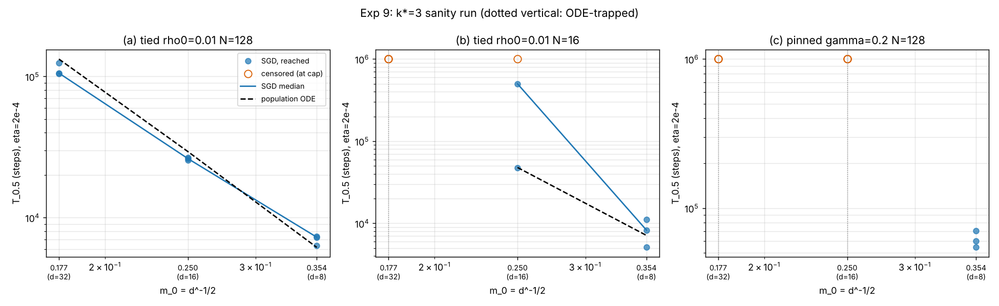

# Experiment 9: k*=3 sanity run (single neuron, tied A-tilde and pinned Model A, k=3)

Pre-registration: `docs/preregistration.md`, section "`k*=3` sanity run (exp 9, backlog N3)" (P22a-c; committed in f913902 before any run).
Spec: `docs/spec_exp9.md`. ODE predictions: `scripts/ode_k3.py` -> `ode_predictions.csv` (fixed before the run).
Code: `icl_additive/sweep9.py` (modelled on `sweep7.py`; calls `train.train(model, d, 3, 2e-4, seed, ...)`), analysis `icl_additive/analyze9.py`.
Raw rows: `runs.csv` (27 runs), trajectories `traj/*.npz`, stdout `stdout.txt`. Derived: `summary.csv`, `secants.csv`, `ratios.csv`, `verdicts.csv`, `figs/k3.png`.

## Setup (as pre-registered)

k=3 (sigma_3 = He_3/sqrt(6)), `init="fixed"`, `m0_scale=1.0` so m_0 = d^-1/2 exactly (0.3536 / 0.25 / 0.1768), B=64, **eta = 2e-4 for every cell**,
early stop at |m| >= 0.5, cap 1e6 steps, `log_every=100`, `fast=True`, `rng_tag=1000`, seeds {0,1,2}, 1 BLAS thread per worker, 2 workers.
Cells: (a) tied rho_0=0.01, N=128; (b) tied rho_0=0.01, N=16; (c) pinned gamma=0.2 (`train_gamma=False`), N=128; d in {8,16,32}. 27 runs.
Flow time = steps * eta. "Median" counts a censored run (no |m|=0.5 within 1e6 steps) as +infinity. Launch order: a(d=8,16), b(d=8,16), c(d=8), a(d=32), b(d=32), c(d=16), c(d=32).

## Deviations (read first)

- **No change to the spec or the pre-registered criteria.** The only analysis choices I had to make are in the verdicts: P22b's "within +-0.25" is applied to the
  median/median ratio T(N=16)/T(N=128) as an absolute difference from the pre-registered ratio (1.16, 1.63); "d=32 ratio >= 3" uses the median with censored = infinity.
- **CPU time 0.891 h vs the 2 h cap (spec expectation ~1.2 h); no overrun.** Per cell (CPU-h): (a) 0.048, (b) 0.182, (c) 0.661; per-run CPU 2-50 s for the
  short runs, ~143 s (N=16) and ~385 s (N=128) for 1e6-step runs. The 1-minute smoke test (cell a, d=8, seed 0, 2000 steps, run in the scratchpad, 0.8 s CPU) is not counted and its output is not in `results/exp9`.
- The 2 cores were shared with exp 8 (other agent); CPU time is per-process `process_time`, wall time (1692 s) is not a clean measure.
- The pinned cell (c) has no trained readout, so "Gamma at T_0.5" in the table is the pinned value 0.2 (trivially constant).
- Trajectories `traj/*.npz` are written locally but gitignored (repo rule `results/**/traj/*.npz`), so they are not in the commit.
- `runs.csv` column `readout_at_T05` is rho for tied cells (read from the log every 100 steps), NaN for pinned.

## Table: T_0.5 per seed vs ODE

CENS = no escape to |m|=0.5 within 1e6 steps; ODE "trapped" = the population flow never reaches 0.5.

| cell | d | m_0 | T_0.5 per seed (steps) | reached | median steps | median flow T*eta | ODE flow | ODE steps | median/ODE | rho (tied) or Gamma (pinned) at T_0.5 (seeds) | final \|m\| |
|---|---|---|---|---|---|---|---|---|---|---|---|
| a tied N=128 | 8 | 0.3536 | 7271 / 7336 / 6332 | Y/Y/Y | 7271 | 1.45 | 1.23 | 6158 | 1.18 | 0.01043 / 0.01042 / 0.0105 | 0.500 / 0.500 / 0.500 |
| a tied N=128 | 16 | 0.2500 | 26221 / 26717 / 25491 | Y/Y/Y | 26221 | 5.24 | 5.88 | 29401 | 0.89 | 0.01099 / 0.01069 / 0.01073 | 0.503 / 0.501 / 0.500 |
| a tied N=128 | 32 | 0.1768 | 124726 / 105683 / 104788 | Y/Y/Y | 105683 | 21.14 | 26.58 | 132880 | 0.80 | 0.01096 / 0.01083 / 0.01035 | 0.500 / 0.500 / 0.504 |
| b tied N=16 | 8 | 0.3536 | 11073 / 8270 / 5093 | Y/Y/Y | 8270 | 1.65 | 1.42 | 7123 | 1.16 | 0.01007 / 0.0102 / 0.01022 | 0.500 / 0.503 / 0.500 |
| b tied N=16 | 16 | 0.2500 | CENS / 47171 / 499629 | N/Y/Y | 499629 | 99.93 | 9.57 | 47855 | 10.44 | - / 0.008975 / 0.007333 | 0.085 / 0.500 / 0.500 |
| b tied N=16 | 32 | 0.1768 | CENS / CENS / CENS | N/N/N | inf | inf | trapped | inf | - | - | 0.008 / 0.035 / 0.001 |
| c pinned 0.2 N=128 | 8 | 0.3536 | 70624 / 54535 / 60212 | Y/Y/Y | 60212 | 12.04 | 11.83 | 59140 | 1.02 | 0.2 (pinned) | 0.500 / 0.500 / 0.500 |
| c pinned 0.2 N=128 | 16 | 0.2500 | CENS / CENS / CENS | N/N/N | inf | inf | trapped | inf | - | 0.2 (pinned) | 0.021 / 0.032 / 0.028 |
| c pinned 0.2 N=128 | 32 | 0.1768 | CENS / CENS / CENS | N/N/N | inf | inf | trapped | inf | - | 0.2 (pinned) | 0.015 / 0.017 / 0.024 |

rho stays at rho_0 at T_0.5 for cell (a) as predicted (0.0104-0.0110 vs ODE 0.0105-0.0107; recorded, not a criterion). Seed spread in (a) and (c, d=8) is 3-18%; in (b) d=8 it is a factor 2.2
(5.1k-11.1k), and (b) d=16 is heavy-tailed (47k, 500k, censored).

## Secant kappa_eff (2 - slope of log median T vs log m_0)

| cell | d pair | SGD (medians) | ODE |
|---|---|---|---|
| a tied N=128 | 8-16 | 5.70 | 6.51 |
| a tied N=128 | 16-32 | 6.02 | 6.35 |
| b tied N=16 | 8-16 | 13.83 (the d=16 median is a single slow seed, 4.99e5; not a clean exponent) | 7.50 |
| b tied N=16 | 16-32 | undefined (median censored) | undefined (ODE trapped) |
| c pinned N=128 | 8-16, 16-32 | undefined (medians censored) | undefined (ODE trapped) |

## T(N=16) / T(N=128), tied rho_0=0.01

| d | median/median | min-max over 9 seed pairings (censored counted at the cap, i.e. lower bound) | N=16 censored | N=128 censored | ODE |
|---|---|---|---|---|---|
| 8 | 1.14 | 0.69 - 1.75 | 0/3 | 0/3 | 1.16 |
| 16 | 19.05 | 1.77 - 39.2 | 1/3 | 0/3 | 1.63 |
| 32 | inf (3/3 censored; lower bound 8.0-9.5 from the cap) | 8.02 - 9.54 | 3/3 | 0/3 | inf (trap) |

## Censoring table

| cell | d=8 | d=16 | d=32 |
|---|---|---|---|
| a tied N=128 | 0/3 | 0/3 | 0/3 |
| b tied N=16 | 0/3 | 1/3 | 3/3 |
| c pinned 0.2 N=128 | 0/3 | 3/3 | 3/3 |

All censored runs ended with |m| <= 0.085 (mostly 0.001-0.035), i.e. sitting near the origin at 1e6 steps, not creeping towards 0.5.

## Verdicts

**P22a (cell a; tied N=128). FAILED as pre-registered.** Criterion (quoted): "every median within 15% of ODE steps; both secants within +-0.5 of ODE" (secants 6.51 and 6.35).
Measured medians/ODE = 1.18 (d=8, OUT), 0.89 (d=16, ok), 0.80 (d=32, OUT: 20.5% below). Secants 5.70 (d 8-16; 0.81 below 6.51, OUT) and 6.02 (d 16-32; 0.33 below 6.35, ok).
Two of three medians and one of two secants miss the pre-registered band. The pre-registered expectation that d=8 would stay within 15% (discretisation of "a few %") was wrong: SGD is 18% slower than the flow at d=8 and 20% faster at d=32,
so SGD's d-dependence is shallower than the ODE's. The kill condition ("both secants < 5 or both > 8") is **not** triggered: both secants (5.7, 6.0) lie near 2k*=6 and well away from the rival values ~4 (no k-dependence) or ~2 (in-weight-like).
So the qualitative claim (secant kappa_eff close to 2k* = 6 at k=3, versus ~4 at k=2) is supported, but the quantitative ODE prediction at the pre-registered precision is not.

**P22b (cell b vs a). FAILED as pre-registered (partly right).** Criterion (quoted): "ratios within +-0.25 at d=8,16; d=32 ratio >= 3 (censored counts as infinity)".
d=8: 1.14 vs 1.16 (ok). d=32: N=16 censored 3/3, ratio infinite (>= 8.0 even counting censored at the cap), trap/delay as predicted (ok). **d=16: measured median ratio 19.05 vs predicted 1.63 (OUT).**
At d=16 the ODE (N=16) escapes in 4.79e4 steps; one seed matches that (47171), one is 10x slower (499629) and one did not escape in 1e6 steps. So the SGD noise delays the tied N=16 readout well before the flow trap
(rho_trap(d=16) = 0.026 > rho_0 = 0.01 in the flow); the median of three is determined by the slow tail. The same heavy-tailed N=16 behaviour was seen in exp 7 cell c. The qualitative claim "tied readout is not N-flat at k=3, and N=16 is trapped at d=32" holds; the pre-registered d=16 number is wrong.

**P22c (cell c; pinned gamma=0.2). HELD.** Criterion (quoted): "d=8 median within 15%; d=16 and d=32 each censored in >= 2/3 seeds at 1e6 steps".
d=8: median 60212 vs ODE 59140 (1.02, ok; seeds 54.5k-70.6k). d=16: 3/3 censored; d=32: 3/3 censored (both stay at |m| <= 0.032). The m*=0.30 threshold prediction (m_0/m* = 1.18 escapes; 0.83 and 0.59 trapped) is confirmed
including at d=16, where m_0/m* = 0.83 was the closest call: no seed escaped.

## Summary

Held: P22c, the d=8 and d=32 legs of P22b, the 16-32 secant of P22a, and the qualitative `2k*` picture (secant 5.7-6.0, between the rival values 2-4 and the d->inf limit; kill not triggered).
Failed as pre-registered: P22a (d=8 and d=32 medians outside 15%; 8-16 secant 0.81 low) and P22b (d=16 ratio 19 vs 1.63). 27 runs, 0.891 CPU-h (cap 2 h).

## Post-hoc diagnostics (declared in `docs/preregistration.md` before running; `diag/run_diag.py`, `diag/runs.csv`)

| ID | change vs cell (a) | seeds (steps) | median | ODE | median/ODE | verdict |
|---|---|---|---|---|---|---|
| P22d | d=8, eta 2e-4 -> 5e-5 | 23277 / 24815 / 30249 | 24815 | 24632 | 1.007 | held: the 1.18 at eta=2e-4 was discretisation |
| P22e | d=32, B 64 -> 256 | 132061 / 151406 / 164371 | 151406 | 132880 | 1.14 | direction as hypothesised (0.80 -> 1.14: the B=64 deficit was noise-assisted escape); overshoot 14% is within the 3-seed spread but outside the declared 10% band |

CPU: 0.23 h (2 workers, shared with exp 8).
